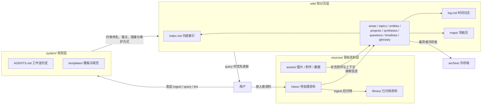
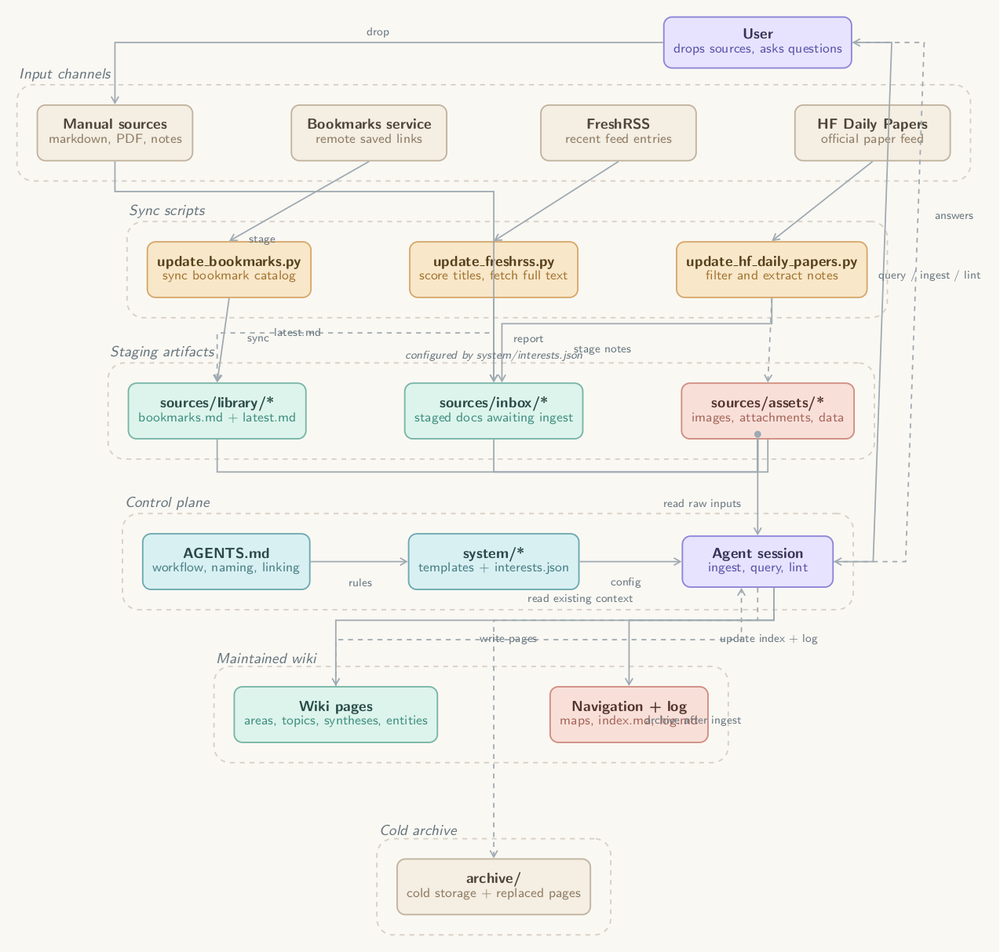

# Wiki — AI-Maintained Personal Knowledge Base

一个面向 AI agent 协作的个人知识库模板。它采用类似 Andrej Karpathy 在 `llm-wiki` 中描述的模式：把原始资料、LLM 维护的 wiki、以及 agent 的维护规则分开管理，让知识不是”每次问都临时检索”，而是被持续整理、交叉链接和累积沉淀。

Fork 或 clone 这个仓库后，根据自己的兴趣配置 `system/interests.json`，就可以开始使用。

参考思路：
- Karpathy, `llm-wiki`: https://gist.github.com/karpathy/442a6bf555914893e9891c11519de94f

## 目标

这个仓库默认服务于三类操作：

1. `ingest`：把新资料纳入知识库。
2. `query`：基于已经整理过的 wiki 回答问题，并把高价值回答沉淀回仓库。
3. `lint`：周期性检查知识库是否存在断链、重复、过时或缺失的页面。

## 组织示意图



可以把它理解成一条很简单的流水线：

- `sources/` 负责存原始输入，尽量不直接改写。
- `wiki/` 负责存整理后的知识页，回答问题时优先读这里。
- `system/` 负责告诉 Agent 应该怎么整理、命名、链接和维护。

Anthropic 风格的仓库架构图：



相关文件：
- [TikZ 源文件](sources/assets/diagrams/repo-architecture-anthropic.tex)
- [PDF 导出](sources/assets/diagrams/repo-architecture-anthropic.pdf)

## 仓库结构

```text
.
├── AGENTS.md              # Agent 的协作规范与工作流
├── README.md              # 仓库总说明
├── system/                # 规则、模板、约定、兴趣配置
├── sources/               # 原始资料，默认不可变
│   ├── inbox/             # 待处理入口
│   ├── library/           # 已归档原始资料
│   └── assets/            # 本地图片、附件、数据文件
├── wiki/                  # Agent 维护的知识页
│   ├── index.md           # 内容索引
│   ├── log.md             # 时间日志
│   ├── maps/              # 导航页 / 主题地图
│   ├── areas/             # 长期领域
│   ├── topics/            # 主题页
│   ├── entities/          # 人物 / 公司 / 术语 / 工具等实体页
│   ├── projects/          # 项目页
│   ├── syntheses/         # 综合分析 / 结论页
│   ├── questions/         # 待回答问题与研究线索
│   ├── timelines/         # 时间线
│   └── glossary/          # 术语表
└── archive/               # 冷存档与废弃内容
```

## 设计原则

- `sources/` 是事实输入层。这里放原文、PDF、网页转存、截图、附件，默认不直接改写。
- `wiki/` 是知识编译层。这里放主题总结、实体关系、对比分析、问题追踪和结论。
- `system/` 是 agent 配置层。这里定义 Agent 应如何命名、落盘、交叉引用和维护一致性。
- `index.md` 偏内容导航，`log.md` 偏时间顺序。两者都应该持续维护。
- 高价值对话结论不应只留在聊天记录里，应该沉淀为 `wiki/` 中的新页面或现有页面更新。

## 推荐使用方式

### 1. 加资料

把新材料先放进 `sources/inbox/`，或者从 bookmarks 服务同步到本地 markdown，例如：

- 一篇网页导出的 markdown
- 一份 PDF
- 一张图表或截图
- 一组会议纪要
- 一批来自 bookmarks 列表的链接

然后告诉 Agent：

```text
请 ingest sources/inbox/xxx.md，把重要结论并入现有 wiki。
```

处理这类任务时，Agent 默认应先 `spawn subagent` 做 ingest，再由主 Agent 统一检查 `wiki/index.md`、`wiki/log.md` 和交叉链接。

如果资料来自 bookmarks：

```text
先更新 sources/library/bookmarks/bookmarks.md，然后从里面挑出和 AI agent tooling 相关的链接做一轮 ingest。
```

### 2. 问问题

直接围绕 `wiki/` 提问，例如：

```text
基于现有 wiki，总结一下 AI agent tooling 这条线的核心判断，并补成一页 synthesis。
```

### 3. 做体检

定期让 Agent 执行整理，例如：

```text
请 lint 一下 wiki，找出孤立页面、重复主题、缺失的实体页和过时结论。
```

## 命名约定

- 目录名和文件名统一使用英文 `kebab-case`
- 页面正文可以用中文，也可以中英混写
- 一类信息一个页面，不把不相干内容堆进大杂烩页面
- 优先写“可链接页面”，而不是只写一次性的聊天答案

## 兴趣配置

仓库中所有与个人兴趣相关的过滤规则和 LLM prompt 都集中在一个配置文件中管理：

```text
system/interests.json
```

首次使用时：

1. 复制 `system/interests.example.json` 为 `system/interests.json`
2. 按照自己的兴趣修改其中的关键词、偏好描述和主题桶
3. 如果不创建 `interests.json`，脚本会自动回退使用 `.example.json` 中的示例配置

配置文件结构：

| 字段 | 用途 |
|------|------|
| `rss_filter` | FreshRSS 同步时基于关键词的预过滤规则（标签、权重、匹配词） |
| `rss_taste_profile` | RSS LLM 过滤 prompt 中的自然语言兴趣描述 |
| `paper_filter` | HF Daily Papers LLM 过滤 prompt 中的研究兴趣描述 |
| `paper_knowledge` | 论文知识抽取 prompt 中的关注方向 |
| `related_topic_links` | 生成的论文源文件中自动添加的 wiki 交叉链接 |
| `default_topic_buckets` | CLAUDE.md 中建议的默认主题起点 |

prompt 模板文件（`system/templates/*.md`）中使用 `{{PLACEHOLDER}}` 标记，脚本运行时会自动替换为配置中对应的内容。

## 起步建议

- 先围绕 5-10 个核心主题持续积累，不要一开始就把目录切得太细
- 先让 `topics/` 和 `syntheses/` 长起来，再按需要补 `entities/` 和 `timelines/`
- 每次 ingest 至少更新三处：相关主题页、`wiki/index.md`、`wiki/log.md`

## 可选下一步

- 初始化 git：`git init`
- 用 Obsidian 打开本目录，直接浏览 `wiki/`
- 后续补一个本地搜索脚本，用于快速检索 `wiki/` 和 `sources/`

## Bookmarks 同步

仓库内置了一个同步脚本：

```text
python3 scripts/update_bookmarks.py
```

它会读取本地忽略的 `.env.bookmarks.local`，然后更新：

```text
sources/library/bookmarks/bookmarks.md
```

建议流程：

1. 复制 `.env.bookmarks.example` 为 `.env.bookmarks.local`
2. 在本地填入 bookmarks 服务地址和 API key
3. 运行同步脚本
4. 再让 Agent 基于 `bookmarks.md` 选择值得 ingest 的链接

示例定时任务：

```cron
15 * * * * cd /root/wiki && python3 scripts/update_bookmarks.py >> /tmp/bookmarks-sync.log 2>&1
```

注意：

- 实例地址和 API key 只放在 `.env.bookmarks.local`，不会进入 git
- 生成的 `bookmarks.md` 默认会进入仓库；如果你不想让收藏链接进入 git，可以额外把该文件加入 `.gitignore`
- 如果你的实例有 IP / 证书兼容问题，可在 `.env.bookmarks.local` 里补 `BOOKMARKS_FORCE_IPV4=1`、`BOOKMARKS_FORCE_IPV6=1` 或 `BOOKMARKS_VERIFY_TLS=0`

## FreshRSS 同步

仓库内置了一个 FreshRSS 来源脚本：

```text
python3 scripts/update_freshrss.py
```

它会读取本地忽略的 `.env.freshrss.local`，然后执行两阶段流程：

1. 从 FreshRSS 拉最近的订阅消息元数据
2. 仅根据 `来源 + 标题` 按兴趣做第一轮过滤
3. 只对入选条目抓网页正文
4. 更新 `sources/library/freshrss/freshrss-latest.md`
5. 把入选文章写入 `sources/inbox/freshrss/`，等待后续 ingest

建议流程：

1. 复制 `.env.freshrss.example` 为 `.env.freshrss.local`
2. 在本地填入 FreshRSS 地址、用户名和 API password
3. 运行同步脚本
4. 再让 Agent ingest `sources/inbox/freshrss/` 中的新材料

可选参数：

```text
python3 scripts/update_freshrss.py --limit 80
python3 scripts/update_freshrss.py --include-maybe
```

注意：

- FreshRSS 地址和 token 只放在 `.env.freshrss.local`，不会进入 git
- 第一轮过滤默认偏保守，优先拒绝泛 AI 新闻、低上下文讨论和资源大合集
- 如果某些来源命中率长期偏低，应该继续迭代兴趣规则，而不是直接抓全文

## Hugging Face Daily Papers 同步

仓库内置了一个 Hugging Face Daily Papers 来源脚本：

```text
python3 scripts/update_hf_daily_papers.py
```

它会读取本地忽略的 `.env.hf-daily-papers.local`，然后执行这条流水线：

1. 调 Hugging Face 官方 `daily_papers` API，抓最近几天的论文条目
2. 用便宜的 `codex exec` 子代理按兴趣做相关性过滤
3. 对入选论文优先抓原始论文页 / arXiv abstract，再用便宜子代理提炼知识点
4. 更新 `sources/library/hf-daily-papers/hf-daily-papers-latest.md`
5. 把入选论文写入 `sources/inbox/hf-daily-papers/`，等待后续 ingest

建议流程：

1. 复制 `.env.hf-daily-papers.example` 为 `.env.hf-daily-papers.local`
2. 按需调整抓取窗口、`codex` 模型和 `reasoning_effort`
3. 确保本机 `codex` CLI 已登录
4. 运行同步脚本
5. 再让 Agent ingest `sources/inbox/hf-daily-papers/` 中的新材料

可选参数：

```text
python3 scripts/update_hf_daily_papers.py --days-back 5
python3 scripts/update_hf_daily_papers.py --limit 40
python3 scripts/update_hf_daily_papers.py --refresh-known
```

示例定时任务：

```cron
40 9 * * * cd /root/wiki && python3 scripts/update_hf_daily_papers.py >> /tmp/hf-daily-papers-sync.log 2>&1
```

注意：

- 来源抓取使用 Hugging Face 官方 `https://huggingface.co/api/daily_papers`
- 默认模型配置是 `gpt-5.4-mini` + `model_reasoning_effort=low`，用于降低定时任务成本
- 过滤与抽取都依赖本机 `codex` CLI 凭证；如果 CLI 未登录，脚本会直接失败
- 去重状态保存在 `sources/library/hf-daily-papers/hf-daily-papers-state.json`，避免重复处理同一篇论文
- 知识点抽取优先使用原始论文页文本；抓不到时才回退到 Hugging Face 返回的 abstract / AI summary

## Daily Digest

如果希望三条来源在每日更新后统一发一封摘要邮件，可以使用：

```text
python3 scripts/send_daily_digest.py
```

它会按顺序运行：

1. `scripts/update_bookmarks.py`
2. `scripts/update_freshrss.py`
3. `scripts/update_hf_daily_papers.py`
4. 读取三份最新报告并整理成一封邮件
5. 通过 SMTP 或本机 `sendmail` 发到 `.env.daily-digest.local` 配置的收件人

本地配置：

1. 复制 `.env.daily-digest.example` 为 `.env.daily-digest.local`
2. 确认 `DAILY_DIGEST_TO`
3. 如果使用 Gmail SMTP + OAuth2，填写：
   `DAILY_DIGEST_SMTP_HOST=smtp.gmail.com`
   `DAILY_DIGEST_SMTP_PORT=465`
   `DAILY_DIGEST_SMTP_SECURITY=ssl`
   `DAILY_DIGEST_SMTP_AUTH_METHOD=gmail-oauth2`
   `DAILY_DIGEST_SMTP_USERNAME=你的 Gmail 地址`
   `DAILY_DIGEST_FROM=你的 Gmail 地址`
   `DAILY_DIGEST_GMAIL_OAUTH_CLIENT_ID=你的 Google OAuth client id`
   `DAILY_DIGEST_GMAIL_OAUTH_CLIENT_SECRET=你的 Google OAuth client secret`
   `DAILY_DIGEST_GMAIL_OAUTH_REFRESH_TOKEN=你的 Google OAuth refresh token`
4. 如果使用 Gmail SMTP + app password，把 `DAILY_DIGEST_SMTP_AUTH_METHOD=password`，并填写 `DAILY_DIGEST_SMTP_PASSWORD`
5. 如果不走 SMTP，也可以继续使用本机 `sendmail`

示例定时任务：

```cron
40 9 * * * cd /root/wiki && python3 scripts/send_daily_digest.py >> /tmp/wiki-daily-digest.log 2>&1
```

注意：

- `update` 只负责同步和筛选，不会自动 ingest 到 `wiki/`
- 这封邮件是“来源更新摘要”，不是自动知识整理
- 脚本会优先使用 SMTP 配置；只有未设置 `DAILY_DIGEST_SMTP_HOST` 时才回退到 `sendmail`
- Gmail OAuth2 需要你先在 Google Cloud 创建 OAuth client，并拿到带 `https://mail.google.com/` scope 的 refresh token
- 如果不用 OAuth2，也可以继续使用 app password；不要直接用账号主密码
